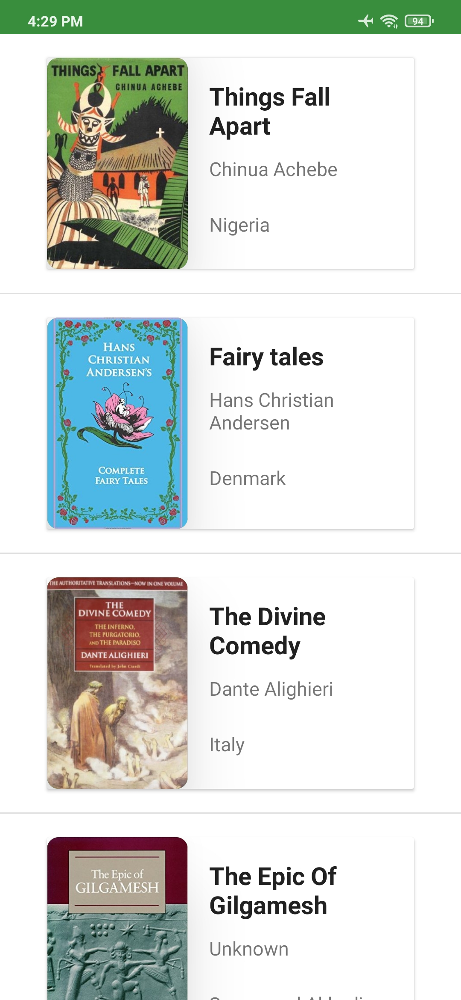
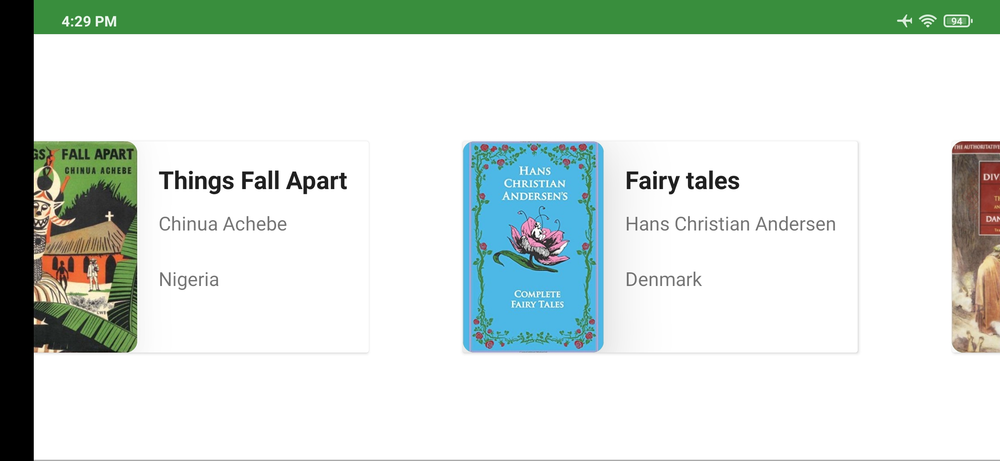
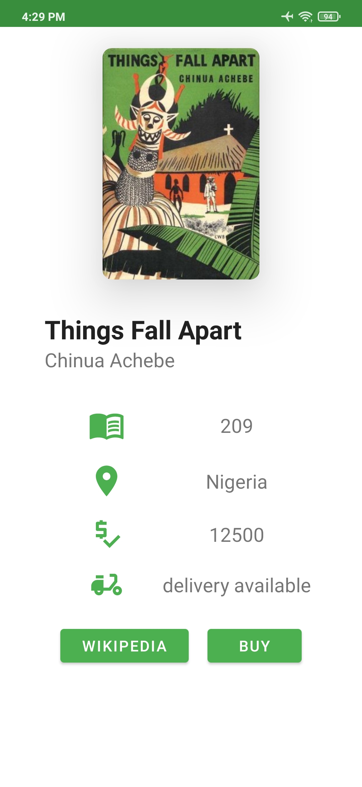
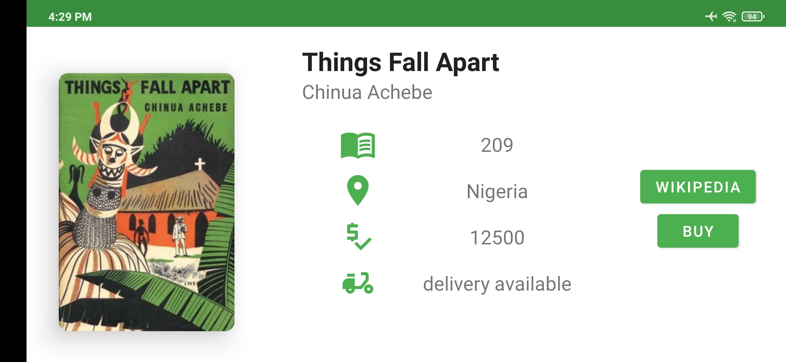

## Qué es ECOS
Es una app Android que visualiza una **lista de libros** donde cada elemento cuenta con imagen, título, autoría y origen. 📔 Al presionar un elemento del listado, cambia de pantalla y visualiza **más datos del libro** como el precio y opción de delivery. 🛍💌 También encontrarás una opción para revisar su información en Wikipedia y **enviar un correo para tramitar su compra**.

### Imágenes del funcionamiento de la app
| 
  | 
  |
|--|--|
| 
Pantalla principal. | 
Pantalla principal en orientación horizontal. |
|
 |
 |
|
Pantalla detalle del libro.|
Pantalla detalle del libro en orientación horizontal. |

### Cápsula del funcionamiento de la app

## Características técnicas
- Lenguaje: Kotlin.
- 🖼 XML layout para construir UI nativo.
- Patrón de arquitectura MVVM.
- Consumo de API RESTful con cliente HTTP Retrofit2.
- 🚀 Navigation Component para navegar entre pantallas.
- Librería Picasso para cargar imágenes.
- 💾 BBDD SQLite con una capa de abstracción Room.
- 👟 Coroutines.
- LiveData y Flow.
- 🔎🤓 Unit Testing: Room, Repository and ViewModel.
- 🔄 Vista adaptable según orientación del dispositivo.
- Intent: información web y enviar correo.
